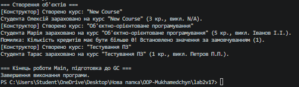

# Лабораторна робота №2

**Тема:** Клас із кількома конструкторами. Життєвий цикл об’єкта.  
**Мета:** Навчитися реалізовувати перевантажені конструктори, дослідити ланцюговий виклик конструкторів (`: this()`) та зрозуміти основи життєвого циклу об’єкта в C# (Варіант 17: клас `Course`).

## Хід роботи

У ході виконання роботи за допомогою .NET CLI у директорії `OOP-Mukhamedchyn` було створено консольний проєкт `lab2v17`.

У файлі `Program.cs` реалізовано клас `Course`, що містить:
* **Приватні поля:** `_title`, `_teacherName`, `_credits`.
* **Публічні властивості:** з валідацією (перевірка умови `Credits > 0`).
* **Конструктори:** перевантажені конструктори з використанням ланцюгового виклику `: this(...)`.
* **Метод:** `EnrollStudent()` для сповіщення про зарахування студента.
* **Деструктор:** `~Course()` для демонстрації фіналізації об'єкта.

У точці входу `Main`:
1. Створено 3 об'єкти класу `Course` з різними наборами параметрів.
2. Перевірено роботу валідації некоректних даних.
3. Продемонстровано роботу *Garbage Collector* шляхом обнулення посилань (`null`) та примусового виклику `GC.Collect()` і `GC.WaitForPendingFinalizers()`.

## Результат виконання програми

