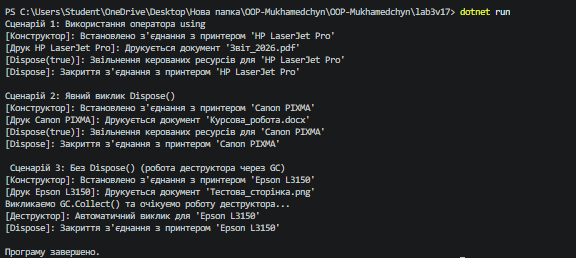

# Лабораторна робота №3

**Тема:** Життєвий цикл об’єкта та керування ресурсами.  
**Мета:** Поглибити розуміння життєвого циклу об’єкта в C#, навчитися працювати з некерованими ресурсами, реалізувати інтерфейс `IDisposable` та патерн Dispose (Варіант 17: клас `PrinterConnection`).

## Хід роботи

У ході виконання роботи за допомогою .NET CLI у директорії `OOP-Mukhamedchyn` було створено консольний проєкт `lab3v17`.

У файлі `Program.cs` реалізовано клас `PrinterConnection`, що містить:
* **Приватні поля:** `_printerName` (назва принтера), `_isConnected` (стан підключення), `_disposed` (прапорець для відстеження стану знищення об'єкта).
* **Публічні властивості:** `PrinterName` та `IsConnected` для доступу до стану об’єкта.
* **Конструктор:** ініціалізує об’єкт та імітує встановлення з'єднання з принтером (`_isConnected = true`).
* **Метод:** `Print(string document)` для імітації виводу документа на друк з перевіркою стану об'єкта.
* **Патерн Dispose:** 
  * Публічний метод `Dispose()` із викликом `GC.SuppressFinalize(this)`.
  * Захищений віртуальний метод `Dispose(bool disposing)` для роздільного звільнення керованих і некерованих ресурсів.
  * Деструктор (фіналізатор) `~PrinterConnection()`, що викликає `Dispose(false)`.

У точці входу `Main` продемонстровано три сценарії керування ресурсами:
1. Автоматичне звільнення ресурсів за допомогою оператора `using`.
2. Явний (ручний) виклик методу `Dispose()`.
3. Неявне звільнення ресурсів через збирач сміття (Garbage Collector) із задіянням деструктора за допомогою `GC.Collect()` та `GC.WaitForPendingFinalizers()`.

## Результат виконання програми

