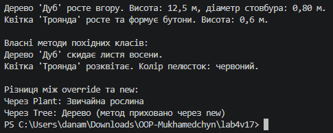

# Лабораторна робота №4

**Тема:** Наслідування. Ключові слова `base`, `override`, `virtual`. Приховування членів (`new`).  
**Мета:** Навчитися створювати ієрархії класів, використовувати ключові слова `base`, `virtual`, `override` для реалізації поліморфізму, а також розуміти відмінності між `override` та приховуванням членів за допомогою `new` (Варіант 17: ієрархія `Plant → Tree → Flower`).

## Хід роботи

У ході виконання роботи за допомогою .NET CLI у директорії `OOP-Mukhamedchyn` було створено консольний проєкт `lab4v17`.

У файлі `Program.cs` реалізовано ієрархію класів, що містить:
* **Базовий клас `Plant`:** приватні поля `_name`, `_height`, публічні властивості `Name`, `Height`, конструктор та віртуальний метод `Grow()`.
* **Похідний клас `Tree`:** поле `_trunkDiameter`, властивість `TrunkDiameter`, конструктор із викликом `base(...)`, перевизначений метод `Grow()` та власний метод `ShedLeaves()`.
* **Похідний клас `Flower`:** поле `_petalColor`, властивість `PetalColor`, конструктор із викликом `base(...)`, перевизначений метод `Grow()` та власний метод `Bloom()`.
* **Демонстрація `new`:** у класі `Tree` створено метод `new GetPlantType()`, який приховує метод `GetPlantType()` базового класу `Plant`.

У точці входу `Main`:
1. Створено об’єкти базового та похідних класів.
2. Продемонстровано поліморфну поведінку методів `Grow()` через посилання на базовий клас `Plant`.
3. Викликано унікальні методи похідних класів `ShedLeaves()` та `Bloom()`.
4. Показано різницю між `override` та `new` під час виклику `GetPlantType()` через посилання типів `Plant` і `Tree`.

## Результат виконання програми

## Відповіді на контрольні запитання

1. **Поясніть принцип наслідування в ООП. Наведіть приклад з реального світу.**  
   Наслідування дає змогу створити новий клас на основі вже існуючого. Похідний клас отримує доступ до відкритих і захищених членів базового класу та може розширити або змінити його поведінку. Наприклад, `Tree` і `Flower` є різновидами `Plant`: обидва мають назву, висоту та можуть рости, але кожен реалізує ріст по-своєму.

2. **Для чого використовується ключове слово `base`? Наведіть приклади його застосування.**  
   `base` використовується для звернення до членів базового класу. У роботі `base(name, height)` викликає конструктор `Plant` із конструктора `Tree` або `Flower`. Також за допомогою `base.Method()` можна викликати реалізацію методу базового класу з перевизначеного методу.

3. **У чому полягає різниця між `virtual` та `override`? Як вони забезпечують поліморфізм?**  
   `virtual` позначає метод базового класу, який дозволено перевизначати. `override` створює нову реалізацію цього методу в похідному класі. Завдяки цьому виклик `Grow()` через посилання типу `Plant` виконує реалізацію фактичного типу об’єкта — `Tree` або `Flower`.

4. **Коли варто використовувати модифікатор `new` для приховування члена базового класу, і які наслідки це має?**  
   `new` використовують, коли похідний клас навмисно має надати член із таким самим іменем, але без поліморфного перевизначення. Вибір методу залежить від типу посилання: `Plant treeAsPlant` викликає метод `Plant`, а `Tree tree` — метод `Tree`. Через це `new` слід використовувати обережно, оскільки поведінка може бути неочевидною.
