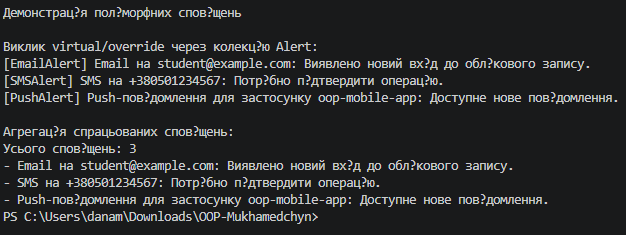

# Лабораторна робота №5

**Тема:** Поліморфізм: динамічне зв’язування та перевизначення методів.  
**Мета:** Навчитися реалізовувати поліморфну поведінку за допомогою віртуальних методів та їх перевизначення, а також агрегувати результати поліморфних викликів (Варіант 17: ієрархія `Alert → EmailAlert, SMSAlert, PushAlert`).

## Хід роботи

У ході виконання роботи за допомогою .NET CLI у директорії `OOP-Mukhamedchyn` було створено консольний проєкт `lab5v17`.

У файлі `Program.cs` реалізовано ієрархію класів, що містить:
* **Базовий клас `Alert`:** приватне поле `_message`, публічну властивість `Message`, властивість `TriggerDescription`, конструктор та віртуальний метод `Trigger()`.
* **Похідний клас `EmailAlert`:** поле `_recipientEmail`, властивість `RecipientEmail`, конструктор із викликом `base(...)` та перевизначений метод `Trigger()` для відправлення повідомлення електронною поштою.
* **Похідний клас `SMSAlert`:** поле `_phoneNumber`, властивість `PhoneNumber`, конструктор із викликом `base(...)` та перевизначений метод `Trigger()` для відправлення SMS.
* **Похідний клас `PushAlert`:** поле `_appId`, властивість `AppId`, конструктор із викликом `base(...)` та перевизначений метод `Trigger()` для надсилання push-повідомлення.

У точці входу `Main`:
1. Створено колекцію `List<Alert>` об’єктів базового типу.
2. Додано до колекції екземпляри `EmailAlert`, `SMSAlert` та `PushAlert`.
3. У циклі викликано метод `Trigger()` для кожного елемента колекції, що демонструє динамічне зв’язування.
4. Результати всіх поліморфних викликів зібрано до списку `triggeredAlerts`.
5. Виведено кількість і список усіх спрацьованих сповіщень.

## Результат виконання програми

## Відповіді на контрольні запитання

1. **Що таке поліморфізм і як він реалізується в C# за допомогою `virtual` та `override`?**  
   Поліморфізм — це здатність об’єктів різних класів реагувати на однаковий виклик по-різному. У C# базовий клас позначає метод модифікатором `virtual`, а похідні класи надають власну реалізацію за допомогою `override`. У роботі виклик `Trigger()` через посилання типу `Alert` виконує відповідну реалізацію для `EmailAlert`, `SMSAlert` або `PushAlert`.

2. **Поясніть поняття динамічного зв’язування. Чим воно відрізняється від статичного?**  
   Динамічне зв’язування визначає фактичну реалізацію віртуального методу під час виконання програми на основі реального типу об’єкта. Статичне зв’язування визначає викликаний метод під час компіляції за типом посилання. Наприклад, елементи `List<Alert>` мають тип посилання `Alert`, але під час виконання викликаються методи конкретних похідних класів.

3. **Наведіть приклад, як поліморфізм дозволяє писати більш гнучкий та розширюваний код.**  
   Метод обробки колекції працює з типом `Alert` і не залежить від конкретного способу доставки. Щоб додати, наприклад, `WebhookAlert`, достатньо успадкувати його від `Alert` і перевизначити `Trigger()`. Код у `Main` при цьому можна не змінювати.

4. **Які переваги дає використання колекцій базових типів для роботи з поліморфними об’єктами?**  
   Колекція базового типу дає змогу зберігати різні похідні об’єкти разом, обробляти їх одним циклом і викликати спільний віртуальний метод. Це зменшує дублювання коду та спрощує додавання нових типів об’єктів. У цій роботі така колекція також дає змогу агрегувати результати всіх спрацьованих сповіщень.
